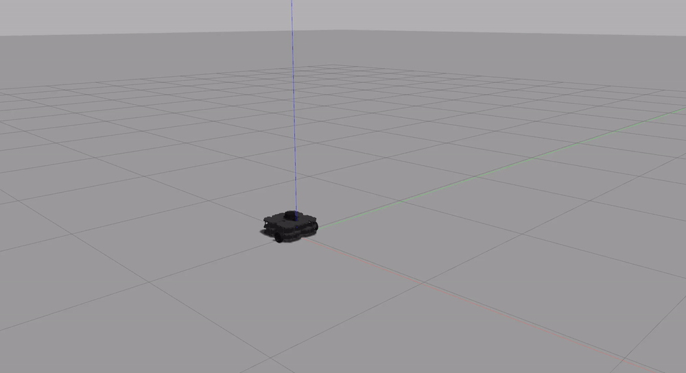

# warmup_project

**Driving in a Square**
For this exercise I decided to employ a time-based approach. While potentially less accurate than the odometry approach, I chose this method because I am still familizaring myself with Turtlebot and object-oriented programing.

I created two Twist() commands, one for moving in a straight line and a constant speed and the other for turning. Since my turn command goes at 30 degrees a second, I initilly had my robot turn for 3 seconds. However, I suspect that between the noise and the acceleration required for the robot to reach the 30 degrees/second, a little extra time was needed -- this was done by trial and error.

Then, I simply pieced the forward() and turn() commands together via an infinite while loop. I used time.time() to keep track of the time that elapsed and when the robot should switch between forward() and turn() (and vice versa).

//Code structure:
This program uses a SquareDriver class. The run() definition keeps the program running, while the initization, the turn(), and the forward() commands are executed in the __init__ def via the time-based approach described above.

**Wall Follower**
The bot divides the LIDAR scan into several distinct ranges and uses the minimum distance from each range to determine its linear and angular velocity. Broadly speaking, if the front of the bot is free of walls it will move forward (the speed varies depending on the wall's distance from other sides of the bot).

If there is a wall in front of the bot (defined as the 45 degree arc from the bot's direct front), it will execute a turn (turning speed varies depending on the walls angle from the bot's front).

Finally, as a failsafe, if the bot deviates too far from the way it will execute to turn to take it back closer to the wall.

**Person Follower**
Similar to Wall Follower, Person Follower divides the bot's 360 degree LIDAR scans into 9 distinct regions. There are four regions on each side of the bot with the ninth region corresponding to the 30 degree area directly in front of the bot. Each region triggers a different angular velocity, and code was written in such a way so that instructions from regions behind the bot are overwritten by instructions coming from regions closer to the front of the bot.

In the edge case where the person is directly behind the bot, the bot will prefer to turn to its right to reach the person.

There are three different "switches" to control linear speed. If the bot is far from the person, it will move quickly (currently 1m/sec). If it moves past a deceleration distance, it will slow down to 0.2 m/sec. Finally, if it overshoots its stopping distance from the person, it will use proportional control to back upto the correct stopping distance.

**Challenges**
This is one of the first times I have ever done object-oriented programming so getting used to this style took some time. Conceptually, I felt like I understand how object-oriented programming works but there were a lot of small implementation mistakes I made initially. Using stackoverflow and other online forums for beginners was a big help in debugging the small mistakes I made.

With regards to these exercises, I initially had some trouble understanding the output from LaserScan. In particular, I could not, for the longest time, figure out if the angles outputted from the LIDAR went clockwise or counterclockwise. I was able to overcome this will a lot of trial and error with the robot.

**Future Work**
While my robot is functional, there are still instances when it exhibits minor "hiccups." For example, in wall follower, after turning a corner, my bot sometimes overcompensates before adjusting to follow the wall at a constant distance. If I had more time, tweaking the code to remove the bot's tendency to overcompensate would be a priority. I think it would also be prudent to add code that would enable my bot to navigate an "open" corner (per Slack, this was not something we needed to account for).

**Takeaways**
1) Remain open-minded. I think computer science majors do this less often than other students but we still sometimes silo ourselves into a particular strategy or method. It is important to explore all strategies so that if you initial ideas do not work you can switch to other ideas. This seems very important in robotics given all the sensors and the noise that bots have to deal with.

2) Baby steps are best. I find it helpful to program in small steps. Instead of writing the entire program out before running the bot in Gazebo, it is useful to code a particular function or edge case and then test it out in Gazebo. To this end, the use of print statements -- especially for sensor outputs (ie. I used LIDAR distances at 0, 90, and 270 degrees) -- is helpful for understanding how the bot is thinking through its environment. Print statements made me realize that Gazebo adds in noise and, as such, my code needed to account for that.

